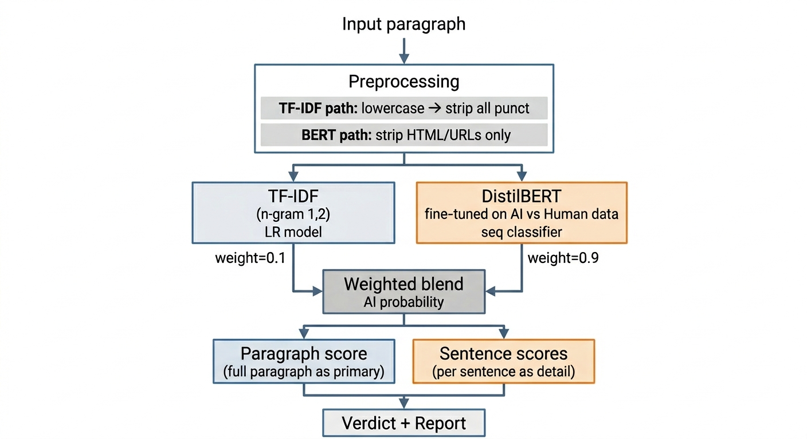

# AI Plagiarism Detector

A binary text classifier that detects whether a given paragraph was written by a human or generated by an AI (ChatGPT, GPT-2, etc.). Built with a fine-tuned DistilBERT model ensembled with a TF-IDF Logistic Regression baseline, served via a Gradio web UI.

---

## Architecture overview


---

## How detection works

### Step 1 — Dual preprocessing
The input text is preprocessed differently for each classifier:
- **TF-IDF path**: heavy cleaning — lowercase, strip HTML/URLs, remove all punctuation (bag-of-words only needs word tokens)
- **BERT path**: light cleaning — strip HTML/URLs, preserve punctuation, casing, and sentence structure (BERT uses these as features)

### Step 2 — Two parallel classifiers

**TF-IDF + Logistic Regression (weight: 0.1)**
Converts text into a sparse bag-of-words vector using unigrams and bigrams (up to 30,000 features). A logistic regression model trained on this representation captures vocabulary-level patterns — AI models tend to use formal, repetitive, and predictable word combinations.

**Fine-tuned DistilBERT (weight: 0.9)**
A pre-trained DistilBERT transformer is fine-tuned for binary sequence classification (max 256 tokens, learning rate 2e-5). Unlike TF-IDF, BERT understands context, punctuation patterns, sentence structure, and semantic meaning. It captures subtler signals like uniform sentence rhythm, overly coherent transitions, and the absence of irregularities typical of human writing.

### Step 3 — Weighted ensemble
The two AI probability scores are blended:

```
final_score = 0.1 × LR_ai_prob + 0.9 × BERT_ai_prob
```

The paragraph is scored as a whole unit (not split into sentences) for the primary score. Sentence-level scores are provided as supplementary detail.

### Step 4 — Verdict thresholds

| AI confidence | Verdict |
|---|---|
| ≥ 85% | Very likely AI-generated |
| 65–85% | Possibly AI-generated |
| 40–65% | Uncertain |
| < 40% | Likely Human-written |

---

## Training data

The model is trained on a combination of datasets covering multiple writing styles:

| Source | Type | Label |
|---|---|---|
| `andythetechnerd03/AI-human-text` | Student essays (ChatGPT vs human) | AI / Human |
| `Hello-SimpleAI/HC3` | ChatGPT vs human QA answers | AI / Human |
| `aadityaubhat/GPT-wiki-intro` | GPT-2 Wikipedia intros vs real intros | AI / Human |
| `cnn_dailymail` | News articles (journalism) | Human |
| `webis/tldr-17` | Reddit posts (informal/casual) | Human |

Total: ~80,000 samples (40,000 AI, 40,000 Human), balanced before training.

---

## Project structure

```
├── module_0_dataset_downloading.py  # Load datasets from HuggingFace, build data.csv
├── module_1_data_prep.py            # scrub_text (TF-IDF), clean_for_bert (BERT), train/val/test split
├── module_2_features.py             # TF-IDF vectorizer fit and transform
├── module_3_embeddings.py           # SBERT sentence embeddings (optional)
├── module_4_baseline_model.py       # Train and save Logistic Regression
├── module_5_bert_finetune.py        # Fine-tune DistilBERT classifier
├── module_6_ensemble.py             # Probability extraction and ensemble utilities
├── module_7_inference.py            # Paragraph + sentence scoring pipeline
├── module_8_gradio_ui.py            # Gradio web interface
├── data.csv                         # Training data (generated by module_0)
├── tfidf_vectorizer.pkl             # Saved TF-IDF vectorizer
├── lr_model.pkl                     # Saved Logistic Regression model
├── lr_encoder.pkl                   # Saved label encoder
└── distilbert_detector/             # Saved DistilBERT model + tokenizer
```

---

## Running the project

```bash
# Install dependencies
pip install -r requirements.txt

# Generate training data
python module_0_dataset_downloading.py

# Train models (in order)
python module_1_data_prep.py
python module_2_features.py
python module_4_baseline_model.py
python module_5_bert_finetune.py

# Run inference test
python module_7_inference.py

# Launch web UI
python module_8_gradio_ui.py
```

---

## Limitations

- Detection is probabilistic, not absolute — confident humans and careful AI writers can fool the model
- Short inputs (< 2 sentences) produce less reliable scores
- The model was trained primarily on English text and may not generalise to other languages
- AI models released after the training data cutoff may produce lower detection rates as their writing style evolves
