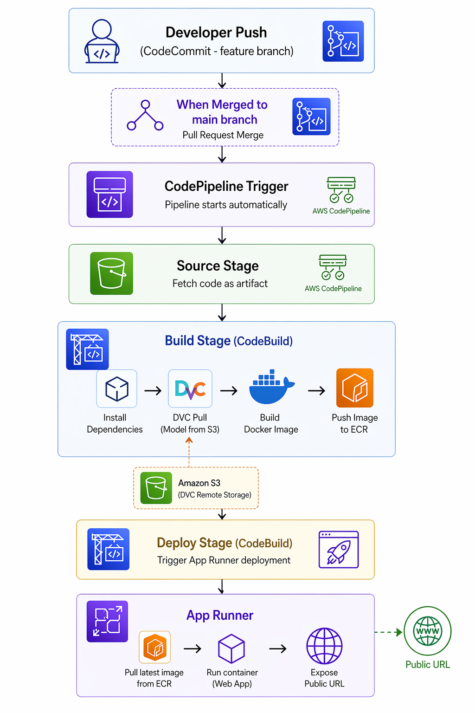

# AI Plagiarism Detection

A binary text classifier that answers one question: does a piece of writing look more like human writing or AI-generated writing?

The model is a fine-tuned DistilBERT classifier trained on a mixed dataset of essays, Q&A responses, Wikipedia-style text, news articles, and Reddit posts. A trained checkpoint ships with the repo under `distilbert_detector/`.

It is best thought of as a screening tool, not a final authority. It can flag suspicious text but should not be used as proof that someone cheated or copied from an AI system.

---

## Pipeline architecture



---

## What is in the repo

- `dataset_downloading.py` — pulls text from Hugging Face datasets, balances classes, writes `data.csv`
- `preprocessing.py` — cleans text, creates stratified train/val/test splits
- `bert_finetune.py` — fine-tunes DistilBERT, logs params and metrics to MLflow, saves model
- `inference.py` — scores a paragraph and gives sentence-level probabilities
- `evaluate.py` — runs the saved model on the test split, logs final metrics to MLflow
- `gradio_ui.py` — Gradio web app that serves the detector
- `dvc.yaml` — DVC pipeline definition
- `params.yaml` — all hyperparameters and data settings
- `buildspec.yml` — CodeBuild build instructions

---

## How the detector works

1. Text is cleaned lightly — HTML tags and URLs are removed, whitespace is collapsed. Punctuation and casing are kept because the model uses those signals.

2. The cleaned text is tokenized for DistilBERT, truncated to 256 tokens.

3. The model predicts a binary label: `AI` or `Human`.

4. A probability is converted into a verdict using these thresholds:

| AI confidence | Verdict |
|---|---|
| `>= 85%` | Very likely AI-generated |
| `65% to <85%` | Possibly AI-generated |
| `40% to <65%` | Uncertain |
| `< 40%` | Likely human-written |

For longer inputs, each sentence is scored separately so you can see which parts look most suspicious.

---

## Training data

| Dataset | Used for |
|---|---|
| `andythetechnerd03/AI-human-text` | AI and human student-style essays |
| `Hello-SimpleAI/HC3` | AI and human question-answer text |
| `aadityaubhat/GPT-wiki-intro` | GPT-generated and real Wikipedia introductions |
| `cnn_dailymail` | Human-written news articles |
| `webis/tldr-17` | Human-written Reddit-style informal text |

Classes are balanced and capped at `40,000` samples per class.

---

## Model setup

| Parameter | Value |
|---|---|
| Base model | `distilbert-base-uncased` |
| Max sequence length | `256` |
| Batch size | `32` |
| Epochs | `3` |
| Learning rate | `2e-5` |
| Warmup ratio | `0.1` |

All parameters live in `params.yaml` and are read by the training script at runtime.

---

## Project layout

```text
.
├── dataset_downloading.py
├── preprocessing.py
├── bert_finetune.py
├── inference.py
├── evaluate.py
├── gradio_ui.py
├── dvc.yaml
├── dvc.lock
├── params.yaml
├── buildspec.yml
├── Dockerfile
├── distilbert_detector/       # tracked by DVC, not git
├── splits/                    # tracked by DVC, not git
├── data.csv                   # tracked by DVC, not git
├── images/
│   ├── architecture.png
│   └── confusion_matrix.png
├── requirements.txt
├── DEPLOY.md
└── LICENSE
```

---

## Setup

```bash
pip install -r requirements.txt
```

---

## Typical workflow

### Retrain from scratch

```bash
# Run the full DVC pipeline (skips unchanged stages)
python -m dvc repro

# Push artifacts to S3
python -m dvc push

# Commit the updated pipeline lock and push to CodeCommit
git add dvc.lock
git commit -m "chore: retrain"
git push
```

Pushing to CodeCommit triggers CodeBuild, which pulls the model from S3, builds the Docker image, pushes it to ECR, and App Runner redeploys automatically.

### Use the existing model

```bash
# Pull model artifacts from S3
python -m dvc pull

# Run the Gradio UI locally
python gradio_ui.py
```

---

## DVC

Data and model artifacts are versioned in S3 via DVC. Git only stores the lightweight `.dvc` pointer files and `dvc.lock`.

| Artifact | Tracked by |
|---|---|
| `data.csv` | DVC → S3 |
| `splits/` | DVC → S3 |
| `distilbert_detector/` | DVC → S3 |
| `metrics.json` | DVC metrics |
| `confusion_matrix.png` | DVC plots |

---

## MLflow

Every training run logs to MLflow automatically:

- Parameters: model name, batch size, epochs, learning rate, warmup ratio
- Per-epoch metrics: training loss, validation AUC
- Final metrics: accuracy, ROC-AUC, F1, precision, recall, MCC
- Artifacts: confusion matrix

To view the experiment UI locally:

```bash
set MLFLOW_TRACKING_URI=file:///D:/kodes/AI_Plag_Detection/mlruns
python -m mlflow ui --backend-store-uri file:///D:/kodes/AI_Plag_Detection/mlruns
```

Open `http://localhost:5000`.

---

## Evaluation snapshot

| Metric | Score |
|---|---|
| Accuracy | `0.9782` |
| ROC-AUC | `0.9993` |
| F1 (macro) | `0.9782` |
| Precision (macro) | `0.9789` |
| Recall (macro) | `0.9782` |
| MCC | `0.9570` |

These numbers are strong but should be read with caution. Performance often drops when the writing style, model family, or domain shifts away from the training data.

---

## Visuals

Architecture:


Confusion matrix:


---

## Limitations

- This is a classifier, not a plagiarism judge
- A high score does not prove misconduct
- Short passages are harder to classify reliably
- The model is set up for English text only
- Newer language models may produce patterns this model has not seen
- Very polished or formulaic human writing can look AI-like
- AI writing that is deliberately roughened can look human

---

## License

MIT License. See [LICENSE](LICENSE).
