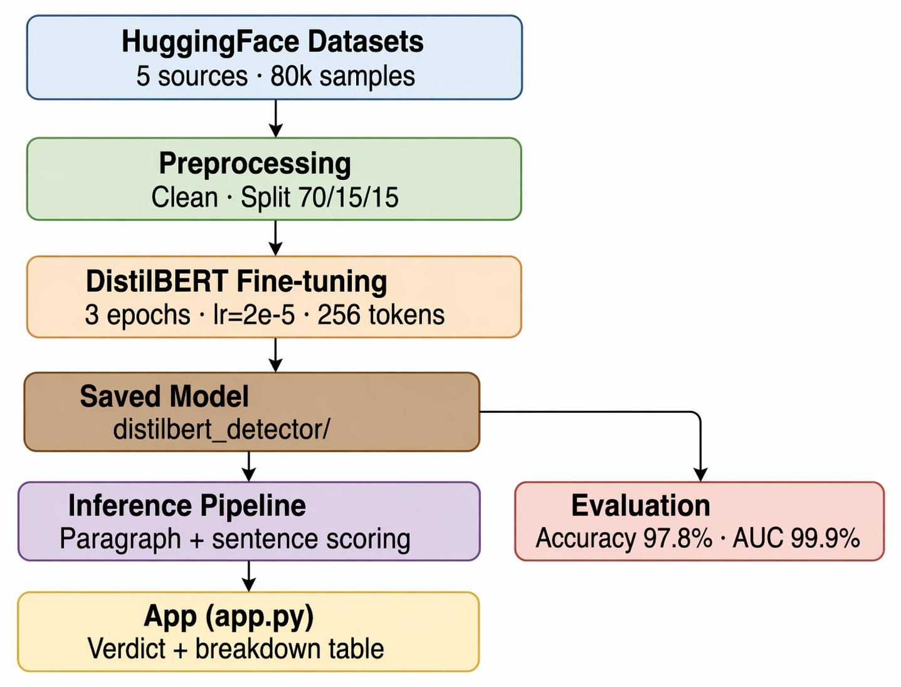
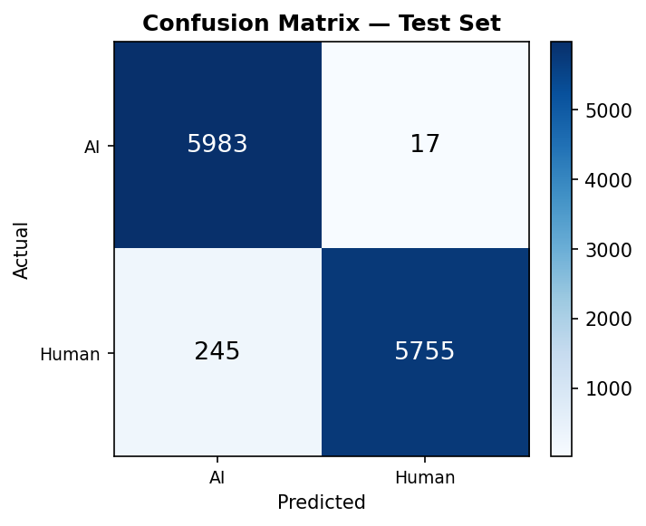

# AI Plagiarism Detection

This project is simple binary text classifier that tries to answer one question: does a piece of writing look more like human writing or AI-generated writing?

The model behind it is a fine-tuned DistilBERT classifier trained on a mixed dataset of essays, Q&A responses, Wikipedia-style text, news articles, and Reddit posts. The repository also includes a saved model under `distilbert_detector/`, so the project is not just training code on paper; there is already a trained checkpoint in the repo.

It is best thought of as an experiment or a screening tool, not a final authority. It can be useful for flagging suspicious text, but it should not be used as proof that someone cheated or copied from an AI system.

## What is in the repo

The code is split into a few small scripts:

- `dataset_downloading.py` pulls text from several Hugging Face datasets, balances the classes, and writes the combined dataset to `data.csv`
- `preprocessing.py` does light cleaning and creates stratified train, validation, and test splits
- `bert_finetune.py` fine-tunes DistilBERT for AI-vs-human classification and saves the model
- `inference.py` scores a paragraph and also gives sentence-level probabilities
- `evaluate.py` runs the saved model on the held-out test split and produces metrics plus a confusion matrix image
- `app.py` is a Flask web application that serves the detector as a local web UI with sentence-level colour highlights

## How the detector works

The pipeline is intentionally straightforward:

1. Text is cleaned lightly.
   HTML tags and URLs are removed, and repeated whitespace is collapsed. Punctuation and casing are kept because the model can use those signals.

2. The cleaned text is tokenized for DistilBERT.
   Inputs are truncated to 256 tokens.

3. The model predicts a binary label.
   The two classes are `AI` and `Human`.

4. A probability is converted into a readable verdict.
   The repo currently uses these thresholds:

| AI confidence | Verdict |
|---|---|
| `>= 85%` | Very likely AI-generated |
| `65% to <85%` | Possibly AI-generated |
| `40% to <65%` | Uncertain |
| `< 40%` | Likely human-written |

For longer inputs, the project also scores each sentence separately so you can see which parts of a paragraph look more suspicious than others.

## Training data

The dataset builder combines multiple sources rather than relying on a single benchmark. That makes the task a bit less narrow, although it also means the final model inherits the quirks of each source.

Sources used in `dataset_downloading.py`:

| Dataset | Used for |
|---|---|
| `andythetechnerd03/AI-human-text` | AI and human student-style essays |
| `Hello-SimpleAI/HC3` | AI and human question-answer text |
| `aadityaubhat/GPT-wiki-intro` | GPT-generated and real Wikipedia introductions |
| `cnn_dailymail` | Human-written news articles |
| `webis/tldr-17` | Human-written Reddit-style informal text |

The script filters out very short entries, balances the two classes, and caps the final dataset at `40,000` samples per class.

## Model setup

The training script uses:

- Base model: `distilbert-base-uncased`
- Max sequence length: `256`
- Batch size: `32`
- Epochs: `3`
- Learning rate: `2e-5`
- Warmup ratio: `0.1`

The trained artifacts are saved to `distilbert_detector/`.

## Project layout

```text
.
├── dataset_downloading.py
├── preprocessing.py
├── bert_finetune.py
├── inference.py
├── evaluate.py
├── app.py
├── templates/
│   └── index.html
├── data.csv
├── distilbert_detector/
├── images/
│   ├── architecture.png
│   └── confusion_matrix.png
├── requirements.txt
└── LICENSE
```

## Setup

Create a virtual environment if you want to keep dependencies isolated, then install the requirements:

```bash
pip install -r requirements.txt
```

## Typical workflow

If you want to rebuild the dataset and retrain the model from scratch:

```bash
python dataset_downloading.py
python preprocessing.py
python bert_finetune.py
python evaluate.py
```

If you mainly want to inspect or use the saved model that already ships with the repo, the important directory is:

```bash
distilbert_detector/
```

## Web UI

`app.py` is a Flask application that wraps the inference pipeline and serves a browser-based detector at `http://127.0.0.1:5000`.

To start it:

```bash
python app.py
```

The UI lets you either paste text directly or upload a `.txt`, `.pdf`, or `.docx` file. Text is extracted automatically and sent to the model. Results are shown as:

- An overall AI confidence score with an animated progress bar and a verdict badge
- Each sentence highlighted in one of four colours based on its individual confidence
- A stats row showing total sentences, AI-flagged sentences, and human-flagged sentences

Hovering over any highlighted sentence shows its exact confidence percentage in a tooltip.

### API endpoints

| Method | Endpoint | Description |
|---|---|---|
| `GET` | `/` | Serves the web UI |
| `POST` | `/analyze` | Accepts `{ "text": "..." }` JSON, returns verdict and per-sentence scores |
| `POST` | `/upload` | Accepts a multipart file (`.txt`, `.pdf`, `.docx`), returns extracted text |

## Evaluation snapshot

The repository reports the following test-set results in its current form:

| Metric | Score |
|---|---|
| Accuracy | `0.9782` |
| ROC-AUC | `0.9993` |
| F1 (macro) | `0.9782` |
| Precision (macro) | `0.9789` |
| Recall (macro) | `0.9782` |
| MCC | `0.9570` |

These numbers are strong, but they should still be read with caution. AI-detection performance often drops when the writing style, model family, or domain shifts away from the training data.

## Visuals

Architecture:



Confusion matrix:



## Limitations

- This is a classifier, not a plagiarism judge
- A high score does not prove misconduct
- Short passages are harder to classify reliably
- The model is mainly set up for English text
- Newer language models may produce writing patterns that this model has not seen
- Human writing that is very polished, formulaic, or edited heavily can look "AI-like"
- AI writing that is deliberately roughened or rewritten by a person can look human

## License

This project is released under the MIT License. See [LICENSE](LICENSE).
